# [SVG Screencast](https://tomashubelbauer.github.io/svg-screencast)




SVG Screencast is a project which generates animated SVG files by using CSS
animations to reveal elements. Feed it an array of screenshots and stamps and it
will determine the changes between frames and output an animated SVG screencast.

## Installation & Usage

Not ready for general use yet, if interested, check out [Development] below.

[Development]: #development

## Features

### Allows the caller to provide screenshots in real time or bulk using the API

SVG Screencast has only a single argument: an asynchronous iterator providing
screenshots as quickly or slowly as the caller wants. The stamps of the frames
are independent of real-time and if the caller provides screenshots faster than
SVG screencast can process them, a runtime cache will hold onto them so that
they all get processed in order eventually without stutter.

### Offers an option to do the heavy lifting in a worker (Node-only for now)

SVG Screencast can work in a mode where it runs in a worker thread, preventing
the main thread from resource starvating even in cases where the SVG Screencast
algorithm does some heavy lifting. Web Worker support is on the roadmap.

### Determines and replaces the damange area with shortest SVG representation

SVG Screencast optimizes the generated file size by using an algorithm for
change detection in the screenshots which results in small patches from one
screenshot to the next instead of a whole screenshot each time. Additionally,
SVG Screencast will look for combinations of patches whose cummulative sizes
are smaller than the individual patches, ensuring the optimal combination is
chosen, resulting in a small file size.

More improvements to the motion detection algorithm are underway.

### Produces SVGs than play in HTML and in GitHub & VS Code MarkDown/SVG preview

SVG Screencast deliberately uses only the most basic SVG and CSS features
ensuring that support for the general files is wide and stable. You can use the
generated SVGs wherever an image is accepted in MarkDown or HTML documents.

### Produces very nicely compressible text files taking little space to transmit

The SVG format is a text-based one and that makes it very suitable for GZIP
compression utilized by many web servers today. Normally, a SVG Screencast file
will take only half its size to transmit over the network when compressed.

## Non-Goals / Limitations

### Does not offer screen recording or video conversion out of the box by design

SVG Screencast has a video conversion tool in its developer tools, but it is
only rudimentary. Officially, it is recommended to pre-process the source media
into screenshots either ahead of time or on the fly using a dedicated and well
suited tool.

### Does not have interactivity of any kind (play/pause, restart, fade scrubbar)

The SVG Screencast generated files should be thought of as images, not videos,
so they do not offer any UI or interactivity. They also do not support sounds.

This is both a design choice and a technical limitation, as SVGs embedded thru
an `img` element will not run JavaScript - they have to be embedded directly in
the HTML for that.

## Development

SVG Screencast works both in browser and in Node. Development and testing is
facilitated using so called *generators*.

Generators are programs which use SVG Screencast at their core, but produce the
screencast from screenshots using platform-specific APIs for image manipulation
(generating/capturing, cropping, saving etc.).

### Electron Generator

```sh
cd electron-generator
npx electron .
```

The generated screencast is written into [`screencast.svg`](screencast.svg).

### Electron Generator (Worker)

```sh
cd electron-generator-worker
npx electron .
```

The generated screencast is written into [`screencast-worker.svg`](screencast-worker.svg).

This generator runs the `screencast.js` code in a Node worker thread.

### Electron Converter

```sh
cd electron-converter
npx electron .
```

### Browser Generator / Converter / Inspector

Web-based tools can be accessed by serving this repository with a web server and
clicking the respective link, e.g.:

```
python3 -m http.server
# http://localhost:8000
```

### Tests

```
cd test
npm install
node .
```

Manual testing is used to ensure no regressions in areas not covered by tests.

### `screencast.js`

This file implements the logic for generating the SVG string with image Base64
data URLs and CSS animations. Technically, animating an array of full-size
screenshots to show up one after another would suffice as an SVG screencast,
but since the intended use for this tool is screen recording conversion, we can
do more:

### `patch.js`

This file implements an algorithm which looks at the RGBA data between the two
screenshots and calculates rectangular, non-overlapping regions of changed
pixels.

- Extend regions touched by the changed pixel in the direction of the pixel
- Do nothing for changed pixels which already fall within an existing region
- Create a new region for changed pixels which do not intersect existing regions

The end result here is an array of regions which need to change from one frame
to the other to complete the transition. This is the simplest optimization pass
possible after merely animating full-size screenshots to appear one after the
other.

### `optimize.js`

This file implements a pass which attempts to optimize the patches calculated in
the prior step for smaller file size. It is separate from `patch.js` because the
work in `patch.js` only depends on the RGBA array of the two screenshots, but in
here, some of the steps also need to consider the SVG string length of would-be
regions which is done by cropping out the new RGBA of the region, encoding it to
PNG, converting the PNG to Base64 and prepending Data URL metadata. When used in
a worker, this requires marshalling potentially large structures across the
boundary (cropping the image) and the steps here which works on combinations of
patches can generate quite a large number of combinations which also costs extra
execution time. Some of the steps here could and maybe will be moved to the
`patch.js` pass eventually, but generally this file hosts more complicated or
costly optimizations or optimizations whose impact is more strongly dependant on
the features in the screenshots.

#### Implemented

**Merging patches of smaller combined SVG length:** This step combines patches
in various ways and sees if the combined patches, if they were a single patch,
would have a smaller SVG string length than if the individual patches were all
placed separately to the SVG. The SVG string length of the combined patch is
calculated by cropping out its would-be region, encoding it to PNG and taking a
Base64 of that and seeing if the resulting Data URL is shorter than the total
length of the Data URLs of the individual patches. It doesn't take the `image`
element SVG string length into an account yet, so improvements could be made.
It also combines the patches in a weird way, it's basically a superset of the
combinations of the patches iterated and for each of those combinations, they
are merged into one and considered and the patches not in that combination
remain standalone. The combination which is the shortest in terms of both the
length of the combined patches' SVG length and the sum of the remaining patches
SVG lengths wins and is taken. Perhaps there is a better way to combine these?
The calculation of the combinations and the SVG string lengths of the candidate
merged patches is expensive, so this step is only allowed to run in case of 5
patches of fewer.

#### To-Do

**Replacing found shorter patch with full-size screenshot if shorter:** It may
happen that the patch combination logic finds a new combined patch whose SVG is
shorter than the individual patches, but it is still larger than if a whole new
frame was encoded - if so, return the new frame as a whole.

**Replacing a single patch with a full-size screenshot if smaller:** If there is
only a single patch, it might still happen that the SVG string of the full-size
screenshot works out to be smaller than the single patch' SVG string. In that
case, return the whole new frame.

**Detecting patches which represent motion of a static area and animate it:** If
the patches are determined to represent an area which is internally static, but
in motion as a whole, we can skip the patch altogether and instead emit an
animation instruction which would move the old patch of this are to the new
location. This could track across frames. Might make sense to try and determine
only horizontal and vertical detection if it is going to be too expensive to
calculate otherwise. This will fail to determine things like a page scrolling,
because the region of that is getting cropped at the same time as its innards
are moving.

**Detecting patches which represent cropping/scrolling and animate the crop:**
Adding to the motion detection above, detecting things which are getting cropped
(like a container with a scrollbar that is being scrolled) could be also useful,
because the scroll+crop motion could also be represent-able using CSS animations
and we could drop the patches representing this motion as a whole.

**Detecting patches representing "uncropping" of a region and animating:** Like
the motion detection and scroll detection ideas, this one too is about replacing
patches with CSS animation. If a region stays constant and is progressively
being expanded/unfolding like typing a text on a single line, we could instead
just emit a patch for the whole final region (the whole line in this example)
and animate its un-cropping using CSS. This could save a lot of patches in the
few cases where it applies.

**Detecting solid color sides or areas within patches and using rects:** Some
changes might result in patches which contain area(s) of solid colors which
might be replacible with rects. Breaking down a single big patch to a few small
patches and a few `rect` usages might provide for a smaller file size.

**Detecting unchanged areas in the bounds of a large patches:** In some cases,
a patch will be created with its content being largely unchanged, for example in
case of something changing a border, a patch would get created which would exist
because of the border but all of its innards would be largely unchanged.
Breaking such a patch down could significately decrease the size of the changes.

**Reverting patches which have negated themselves later without interference:**
In case of something like a popup window, which appears and disappears after a
while, it might make sense to detect this and animate the patch to show and hide
instead of replacing the are twice. This can only work if nothing else entered
the area, otherwise undoing the patch would leave artifacts.

### To-Do

#### Progress on the ideas for `optimize.js` documented in its section

Consider the whole SVG string not just the data URL part in the already
implemented combining logic.

#### Add a parameter for configuring noise tolerance for better video diffing

Right now very slight video artifacts when converting video frames into an SVG
screencast cause very large number of patches to exist between each frame. These
patches have only very slight differences in the color and their number could be
greatly reduced if the tolerance was non-zero and configurable. This problem
only affects already converted video, not screenshots taken as lossless pictures
and fed directly into SVG Screencast.

#### Make runnable through a CLI for video to screencast conversion feature

Use `electron-converter` to build a feature where when called using
`npm tomashubelbauer/svg-screencast screencast.mp4`, a `screencast.svg` file
would get generated in the same directory. Maybe also generate `screencast.html`
which would be the `inspector` application with the SVG pre-loaded or hard-coded
in it for debugging. This will make this project useful as a CLI tool.

#### Clean up the Node worker implementation and add some API usage examples

#### Extend the worker implementation to also support web workers for parity

#### Simplify `node-generator` once Electron supports ESM entry point

`main.cjs` will then be possible to merge into `index.js` and `main` will be
possible to remove in `package.json`.

#### See if playback looping would be possible to do in the CSS animation

I think this should be doable by making all animation durations equal to the
overall duration of the screencast and then calculating a keyframe percentage
that corresponds to the desired duration and animating from hidden, to visible
(at the percentage keyframe) to hidden again. If this rule was played in a loop
(using `infinite`), it should theoretically reveal everything, then hide it all
again and then pick up again.

The naive implementation of this would be to ditch streaming otherwise we could
not compute the ratio of the desired and total duration. Maybe putting all the
frame styles at the end when the total duration is known could be a solution for
looping which preserves the streaming API?

#### Consider optionally adding a scrubbar or another animation length indicator

Need to go with a low-key muted bar at the bottom edge to not interfere with the
content as the scrubbar can't be toggled depending on the pointer state without
JavaScript.

#### Consider adding support for cursor, keystrokes and annotations

These would be extra elements intertwined with the frames. The cursor would be a
standalone image whose coordinates would be obtained using `electron.screen`'s
method `getCursorScreenPoint` adjusted to the window coordinate system. Cursor
icons would not be supported (unless we want to query those in Electron and save
that information, too, in which case they could be and quite trivially, too.).

Keystrokes would be just a `rect` and `text` combo which would pop up at a pre-
determined location and disappear once replaced with another keystroke or once
expired, whichever comes first. A stack of last keystrokes could be kept to make
them available for a guaranteed interval in case of fast typing / shortcut use.

This whole problem generalizes to intertwining custom elements with the frames,
the approaches needed to support cursor and keystrokes are probable capable such
that they could also support custom annotations of any kind, so look into that.

#### Compare SVG size with GIF size with GZIP compression and without

Use FFMPEG to generate a GIF of the same scene as the SVG screencast is showing
and capture the sizes of both as well as their GZIPped sizes using:

```sh
npx gzip-size-cli screencast.svg
```

#### Add an option to output the SVG and external images it links to

This will save space but will increase traffic overhead. This might be a
worthwhile tradeoff for some use-cases, so supporting it seems worth it.
