# [SVG Screencast](https://tomashubelbauer.github.io/svg-screencast)



SVG Screencast is a project which generates animated SVG files by using CSS
animations to reveal elements. Feed it an array of screenshots and stamps and it
will determine the changes between frames and output an animated SVG screencast.

## Installation & Usage

Not ready for general use yet, if interested, check out [Development] below.

[Development]: #development

## Features

- Allows accepting screenshots either ahead of time (bulk) or streamed real-time
- Updates the changed regions only (primitive pixel-diff algorithm as of now)
- Produces SVGs playable in MarkDown/SVG preview on GitHub and in VS Code
- Uses standard SVG and CSS features resulting in great support (even Safari)

## Limitations

- Does not produce minimal file sizes yet, a smarter algorithm is in the works
- Does not have interactivity of any kind, SVG used thru `img` just can't do it
- Does not show the mouse cursor at the moment (a solution is in the works tho)

## Development

To generate `demo.svg`, run `npx electron .` in `demo` to capture the individual
screenshots and then `npm start` (`node .`) to produce the screencast from them.

To run tests, run `npm test` (`cd test && node .`).

### To-Do

#### Demonstrate real-time usage once Electron supports ESM modules

https://github.com/electron/electron/issues/21457

```js
import electron from 'electron';
import screencast from '../screencast.js';

electron.app.once('ready', async () => {
  const window = new electron.BrowserWindow({ width: 600, height: 400 });
  window.loadFile('./index.html');

  async function* screenshot() {
    while (!window.isDestroyed()) {
      const nativeImage = await window.capturePage();
      yield { stamp: new Date(), buffer: nativeImage.toPNG() };
    }
  }

  window.webContents.once('dom-ready', async () => {
    await screencast('../realtime-demo.svg', screenshot());
  });
});
```

#### Spike various techniques to optimize the regionization in `optimize.js`

- Merge regions in case the new single, large patch works out to a smaller size
  than the two individual patches, do this recursively while this holds true.
  Consider making use of the fact that consecutive regions are more likely to be
  mergable than ones further apart (e.g. when typing new characters on the line)
  but not always (e.g. changing starts of the two lines at once or scrolls).
  Pick candidates for merging by calculating the bounding box of the two
  individual patches and seeing if the area of the bounds box is just slightly
  larger than the area of the invidual patches (less unchanged pixesl in the
  patch). But this is just a pre-filter because the real test is if the Base64
  of the single combined patch is smaller than the two individual patches.
- Avoid optimizing frames with a small number of regions (1, 2) as it is not
  likely to be worth it.
- Detect scrolls and moves of regions and use CSS animations for sliding a crop
  across the patch which then becomes a texture or moving the patch in case of
  a translation motion. Scaling and rotation are likely not worth it. In case of
  scrolling, retrospection is needed so that the consecutive patches detected to
  constitute a scroll can be merged to a single image which is cropped and the
  crop is CSS animated instead of embedding the various windows of the whole
  patch individually. This could also be reused for detecting typing on a line
  where the whole line could be a single patch and letters revealed by enlarging
  the crop window.

#### See if playback looping would be possible to do in the CSS animation

I think this should be doable by making all animation durations equal to the
overall duration of the screencast and then calculating a keyframe percentage
that corresponds to the desired duration and animating from hidden, to visible
(at the percentage keyframe) to hidden again. If this rule was played in a loop
(using `infinite`), it should theoretically reveal everything, then hide it all
again and then pick up again.

The naive implementation of this would be to ditch streaming otherwise we could
not compute the ratio of the desired and total duration. Maybe putting all the
frame styles at the end when the total duration is known could be a solution for
looping which preserves the streaming API?

#### Consider optionally adding a scrubbar or another animation length indicator

It seems like JavaScript doesn't run in SVGs which are embedded using the `img`
element: http://thenewcode.com/1094/Using-JavaScript-in-SVG

I also tried using CSS `:hover` pseudoselector and it only seems to work when
accessed directly and not embedded in `img`, too, at least as per the VS Code
MarkDown preview. Maybe it is worth trying on GitHub.

However it seems likely that showing and hiding the scrubbar based on mouse
interaction will be a no-go so we will need to go with something super low-key,
like a muted bar at the bottom edge or something, to not take away from the
content.

#### Consider adding support for cursor, keystrokes and annotations

These would be extra elements intertwined with the frames. The cursor would be a
standalone image whose coordinates would be obtained using `electron.screen`'s
method `getCursorScreenPoint` adjusted to the window coordinate system. Cursor
icons would not be supported (unless we want to query those in Electron and save
that information, too, in which case they could be and quite trivially, too.).

Keystrokes would be just a `rect` and `text` combo which would pop up at a pre-
determined location and disappear once replaced with another keystroke or once
expired, whichever comes first. A stack of last keystrokes could be kept to make
them available for a guaranteed interval in case of fast typing / shortcut use.

This whole problem generalizes to intertwining custom elements with the frames,
the approaches needed to support cursor and keystrokes are probable capable such
that they could also support custom annotations of any kind, so look into that.

#### Build a full-screen recorder by using the platform screenshot capture API

I tried to use FFI and GYP, but it's so stupidly non-straightforward to install
that I have given up on it. It is not worth figuring it out, because it is too
fragile. This functionality can already be supported by just loading up a bunch
of screenshots, but I wonder what could be done to make it also usable in real-
time screenshot streaming.

#### Rewrite the tests and make them work again

This time with PNG samples.

#### Set up a GitHub Actions workflow to run the tests in on every new commit

#### See if it would be possible to use JavaScript to restart the animation

It seems like JavaScript doesn't run in SVGs which are embedded using the `img`
element: http://thenewcode.com/1094/Using-JavaScript-in-SVG
