# [SVG Screencast](https://tomashubelbauer.github.io/svg-screencast)



SVG Screencast is a project which generates animated SVG files by using CSS
animations to reveal elements. Feed it an array of screenshots and stamps and it
will determine the changes between frames and output an animated SVG screencast.

## Development

To generate `demo.svg`, run `npx electron .` in `demo` to capture the individual
screenshots and then `npm start` (`node .`) to produce the screencast from them.

To run tests, run `npm test` (`cd test && node .`).

### To-Do

#### Demonstrate real-time usage once Electron supports ESM modules

https://github.com/electron/electron/issues/21457

```js
import electron from 'electron';
import screencast from '../screencast.js';

electron.app.once('ready', async () => {
  const window = new electron.BrowserWindow({ width: 600, height: 400 });
  window.loadFile('./index.html');

  async function* screenshot() {
    while (!window.isDestroyed()) {
      const nativeImage = await window.capturePage();
      yield { stamp: new Date(), buffer: nativeImage.toPNG() };
    }
  }

  window.webContents.once('dom-ready', async () => {
    await screencast('../realtime-demo.svg', screenshot());
  });
});
```

#### Spike various techniques to optimize the regionization in `optimize.js`

- Merge regions in case the new single, large patch works out to a smaller size
  than the two individual patches, do this recursively while this holds true.
  Consider making use of the fact that consecutive regions are more likely to be
  mergable than ones further apart (e.g. when typing new characters on the line)
  but not always (e.g. changing starts of the two lines at once or scrolls).
  Pick candidates for merging by calculating the bounding box of the two
  individual patches and seeing if the area of the bounds box is just slightly
  larger than the area of the invidual patches (less unchanged pixesl in the
  patch). But this is just a pre-filter because the real test is if the Base64
  of the single combined patch is smaller than the two individual patches.
- Avoid optimizing frames with a small number of regions (1, 2) as it is not
  likely to be worth it.
- Detect scrolls and moves of regions and use CSS animations for sliding a crop
  across the patch which then becomes a texture or moving the patch in case of
  a translation motion. Scaling and rotation are likely not worth it. In case of
  scrolling, retrospection is needed so that the consecutive patches detected to
  constitute a scroll can be merged to a single image which is cropped and the
  crop is CSS animated instead of embedding the various windows of the whole
  patch individually. This could also be reused for detecting typing on a line
  where the whole line could be a single patch and letters revealed by enlarging
  the crop window.

#### See if playback looping would be possible to do in the CSS animation

Would probably have to play around with the animation delay and duration or use
a two step animation for each frame.

#### Add an option to go back to the poster frame at the end of the playback

Do this by creating a CSS rule targetting all images with classes and hiding
them using a CSS animation.

#### Consider optionally adding a scrubbar or another animation length indicator

Maybe with a bit of JavaScript it could be possible to make it appear only on
mouse hover.

#### Capture the cursor and animate it in the screencast as a standalone image

Move the image using CSS animations.
Use `electron.screen.getCursorScreenPoint` and subtract the window position from
it. Introduce a new method `point` distinct from `cast` which emits the `style`
element for moving the cursor. If the cursor tracking and rendering was enabled,
on the first frame, also emit the initial cursor `image` element and hide the
cursor off screen before it is first moved to the viewport.

This will not capture various different cursor states, to have that, we'd either
need to query the system to find the current cursor style or add a `mouseMove`
hook to the client page and relay the cursor state information to the main
process assuming the client page's JavaScript can tell what's the current cursor
state.

#### Display keystrokes in the screencast optionally

Display keys being pressed and shortcuts being used like some screenrecording
software does.

#### Build a full-screen recorder by using the platform screenshot capture API

I tried to use FFI and GYP, but it's so stupidly non-straightforward to install
that I have given up on it. It is not worth figuring it out, because it is too
fragile.

#### Rewrite the tests and make them work again

#### Set up a GitHub Actions workflow to run the tests in on every new commit

#### See if it would be possible to use JavaScript to restart the animation
