# SVG Screencast

[**DEMO**](https://tomashubelbauer.github.io/svg-screencast/screencast.svg.html)

SVG Screencast is a project which generates animated SVG files by using CSS
animations to reveal elements.

In its current form, it is demonstrated using an Electron window, which is
continuously screenshot and the last and next screenshots are compared to find
the region of change, which is then cropped out of the screenshot and used as a
patch for the background. By revealing the patches and timing them accodingly,
an animation, a screencast of the Electron window, is created.

## Running

`npm start` (`electron .`) implicitly renders an SVG screencast to `demo/screencast.svg`

- `npm start svg` explicitly renders an SVG screencast to `demo/screencast.svg`
- `npm start html` explicitly renders an HTML screencast to `demo/screencast.html`

## Testing

`npm test` (`node test`)

## To-Do

### Fix the issue with the diff going crazy (returning a lot of regions) when scrolled

Not only the moment the scroll bar appears, but each subsequent screenshot after the
first scroll generates more and more regions.

BMPs of the last good screenshot and the first bad screenshot saved into
`test/broken`, but they are exported incorrectly. There also correct PNGS for a
check.

### Fix the test cases generated from the hardcoded buffers which fail to parse

### Verify `hi` test case regions are correct

### Consider and spike various techniques to optimize the animation

- Merge regions in case the new single, large patch works out to a smaller size
  than the two individual patches, do this recursively while this holds true.
  Consider making use of the fact that consecutive regions are more likely to be
  mergable than ones further apart (e.g. when typing new characters on the line)
  but not always (e.g. changing starts of the two lines at once or scrolls).
  Pick candidates for merging by calculating the bounding box of the two
  individual patches and seeing if the area of the bounds box is just slightly
  larger than the area of the invidual patches (less unchanged pixesl in the
  patch). But this is just a pre-filter because the real test is if the Base64
  of the single combined patch is smaller than the two individual patches.
- Avoid optimizing frames with a small number of regions (1, 2) as it is not
  likely to be worth it.
- Buffer the incoming screenshots either in memory or on disk (or switch based
  on some threshold) and render the animation in parallel so that the rendering
  lags do not cause stutter in the capturing loop.
- Detect scrolls and moves of regions and use CSS animations for sliding a crop
  across the patch which then becomes a texture or moving the patch in case of
  a translation motion. Scaling and rotation are likely not worth it. In case of
  scrolling, retrospection is needed so that the consecutive patches detected to
  constitute a scroll can be merged to a single image which is cropped and the
  crop is CSS animated instead of embedding the various windows of the whole
  patch individually. This could also be reused for detecting typing on a line
  where the whole line could be a single patch and letters revealed by enlarging
  the crop window.

### Consider looking into headless software rendering just because

https://medium.com/@mohamedmansour/how-to-run-electron-js-in-software-rendering-headless-49601b87961e

### See if looping would be possible to do in the CSS animation

Would probably have to play around with the animation delay and duration or use
a two step animation for each frame.

### Add an option to flip back to the first frame at the end of the video

Do this by creating a CSS rule targetting all images with IDs and hiding them
using an animation.

### Consider optionally adding a scrubbar or another animation length indicator

### Capture the cursor and include it in the animation as a standalone image

Move the image using CSS animations.
Use `electron.screen.getCursorScreenPoint` and subtract the window position from
it. Introduce a new method `point` distinct from `cast` which emits the `style`
element for moving the cursor. If the cursor tracking and rendering was enabled,
on the first frame, also emit the initial cursor `image` element and hide the
cursor off screen before it is first moved to the viewport.

This will not capture various different cursor states, to have that, we'd either
need to query the system to find the current cursor style or add a `mouseMove`
hook to the client page and relay the cursor state information to the main
process assuming the client page's JavaScript can tell what's the current cursor
state.

### Display keystrokes in the animation optionally

Display keys being pressed and shortcuts being used like some screenrecording
software does.

### Extract the code out to a library and allow feeding it frames

Preserve the ability to feed it Electon NativeImage instances and extend it to
allow also passing in blobs so that it can be used in both Node and the browser,
where it might be useful for generating animations in the browser.

### Build a full-screen recorder by using the platform APIs to take a screenshot

I tried to use FFI and GYP, but it's so stupidly non-straightforward to install
that I have given up on it. It is not worth figuring it out, because it is too
fragile.

I also tried using `dotnet script` and do the screnshooting logic in C#, but
Omnisharp is a pain in the ass and that's not worth figuring out either.

It will probably be best to write this directly this program in C or Rust and
send the frames to the JS library.

The library itself will remain written in JavaScript so that it can be used in
CI/CD scenarios to record Electron UI tests etc.
